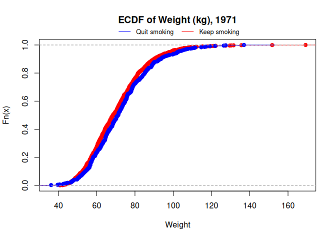

# `ctepi`
> Cumulative Treatment Effect (CTE) with partial identification (PI) on R.


Partial identification bounds for the Average Treatment Effect (ATE) using
the Cumulative Treatment Effect (CTE) estimator. Empirical cumulative distribution
function (ECDF) with partial identification bounds under different assumptions.
Bounds of Williamson and Downs (1990) for the distribution of the difference between
two random variables.

- <a href="#arrow_down-installation"
  id="toc-arrow_down-installation">:arrow_down: Installation</a>
- <a href="#link-quick-links"
  id="toc-link-quick-links">:link: Quick links
  </a>
- <a href="#blue_book-license"
  id="toc-blue_book-license"><strong>:blue_book:</strong> License</a>
- <a href="#rocket-examples" id="toc-rocket-examples">:rocket: Examples</a>


## :arrow_down: Installation

### Install from GitHub

#### Dependencies:

``` r
install.packages("devtools")
install.packages("Rcpp")
```
For Windows users: You must also install `Rtools`. [install Rtools.](https://cran.r-project.org/bin/windows/Rtools/)

#### Installation:

``` r
devtools::install_github("Mautoro/ctepi")
```

## :link: Quick links

### I would like to report a bug

Head to the [ctepi issue tracker](https://github.com/Mautoro/ctepi/issues).


## **:blue_book:** License

GPL 3.0

## :rocket: Examples

For this illustration, we will use the National Health and Nutrition Examination Survey Data | Epidemiologic Follow-up Study (NHEFS). The dataset will be loaded from the `causaldata` package.

``` r
install.packages("causaldata")
nhefs <- causaldata::nhefs
```

The outcome of interest is the patients' weight, measured in the 1st questionnaire (1971) (`wt71`) and in 1982 (`wt82`). The variable `qsmk` is 1 if patients quit smoking between the 1st questionnaire and 1982, and 0 otherwise.

``` r
nhefs$wt71[nhefs$qsmk==0] |> ecdfPI() |> plot(col="red", col.bounds = "red", 
                                              main="Weight (kg), 1971", 
                                              xlim = range(c(nhefs$wt71,nhefs$wt82),na.rm = T) )
nhefs$wt71[nhefs$qsmk==1] |> ecdfPI() |> plot(col="blue",add=T)
legend( "bottom", legend = c("Quit smoking","Keep smoking"), col = c("blue", "red"), 
        lty=1, cex = 0.8 ,inset = c(0,1) , xpd=TRUE, horiz=T, bty="n")
```


Certain individuals do not have weight data available for 1982. The `ecdfPI()` function allows for the inclusion of partial identification bands in the ECDF without assumptions.

``` r
nhefs$wt82[nhefs$qsmk==0] |> ecdfPI() |> plot(col="red", col.bounds = "red", main="Weight (kg), 1982",
                                              xlim = range(c(nhefs$wt71,nhefs$wt82),na.rm = T) )
nhefs$wt82[nhefs$qsmk==1] |> ecdfPI() |> plot(col="blue",add=T)
legend( "bottom", legend = c("Quit smoking","Keep smoking"), col = c("blue", "red"), 
        lty=1, cex = 0.8 ,inset = c(0,1) , xpd=TRUE, horiz=T, bty="n")
```


Let `wt82_71` be defined as `wt82` - `wt71`. Denote by *Y*<sub>1</sub>
and *Y*<sub>0</sub> the counterfactual values of `wt82_71` under quit
smoking and keep smoking, respectively.

Provisionally ignore subjects with missing values for weight in 1982.

``` r
nhefs.nmv <- nhefs[which(!is.na(nhefs$wt82)),]
```

The `parallel = T` option activates parallelization for the calculation.
At present, it is supported only on Unix-like systems.

``` r
bounds1 <- WilliamsonDowns1990( nhefs.nmv$wt82_71 , nhefs.nmv$qsmk , parallel = T)
```

The following plot shows the bounds of Williamson and Downs (1990) for
the distribution of the difference between counterfactual outcomes,
*Y*<sub>1</sub> − *Y*<sub>0</sub>.


``` r
xx <- seq( -80 , 120 , 0.1)

plot( xx , bounds1$Ignorability$ldb(xx) , type="l" , col = "blue4" ,
      xlab = "y" , ylab = bquote(P( Y[1] - Y[0] <= y )) ,
      main= "Williamson and Downs (1990) bounds for Y1-Y0")
lines( xx , bounds1$Ignorability$udb(xx) , col = "blue4")

lines( xx , bounds1$NoAssumptions$ldb(xx) , col = "darkgreen")
lines( xx , bounds1$NoAssumptions$udb(xx) , col = "darkgreen")

legend( "bottom", legend = c("Bounds under no assumptions","Bounds under ignorability"), col = c("darkgreen", "blue4"), 
        lty=1, cex = 0.8 ,inset = c(0,1) , xpd=TRUE, horiz=T, bty="n")
```


The `4-epsilon` assumption relaxes the ignorability assumption for
counterfactual distributions. The following code computes the bounds of
*P*(*Y*<sub>1</sub> − *Y*<sub>0</sub> ≤ *y*) for *ε* values in
{0, 0.1, 0.2, …, 0.9, 1}.

−*ε* ≤ *P*(*Y*<sub>1</sub> ≤ *y*|*Z* = 1) − *P*(*Y*<sub>1</sub> ≤ *y*|*Z* = 0) ≤ *ε*

−*ε* ≤ *P*(*Y*<sub>0</sub> ≤ *y*|*Z* = 1) − *P*(*Y*<sub>0</sub> ≤ *y*|*Z* = 0) ≤ *ε*

At *ε* = 0, the assumption is equivalent to ignorability. At *ε* = 1,
the bounds correspond to those obtained under no assumptions.

``` r
bounds1eps <- list()
grid.eps <- seq(0,1,0.1)
for (i in 1:length(grid.eps) ) {
  bounds1eps[[i]] <- WilliamsonDowns1990( nhefs.nmv$wt82_71 , nhefs.nmv$qsmk , 
                                          parallel = T,
                                          boundaries = "FourEpsilon",
                                          eps11 = grid.eps[i], eps01 = grid.eps[i], 
                                          eps12 = grid.eps[i], eps02 = grid.eps[i] )
}
```


``` r
plot( xx , bounds1$Ignorability$ldb(xx) , type="l" , col = "blue4" ,
      xlab = "y" , ylab = bquote(P( Y[1] - Y[0] <= y )) ,
      main= "Williamson and Downs (1990) bounds for Y1-Y0")
lines( xx , bounds1$Ignorability$udb(xx) , col = "blue4")

for (i in 1:length(grid.eps)) {
  plotecdfbound(bounds1eps[[i]]$FourEpsilon$ldb, 
                bounds1eps[[i]]$FourEpsilon$udb, 
                col.bounds = "darkblue" )
}
```


`Work in progress...`


